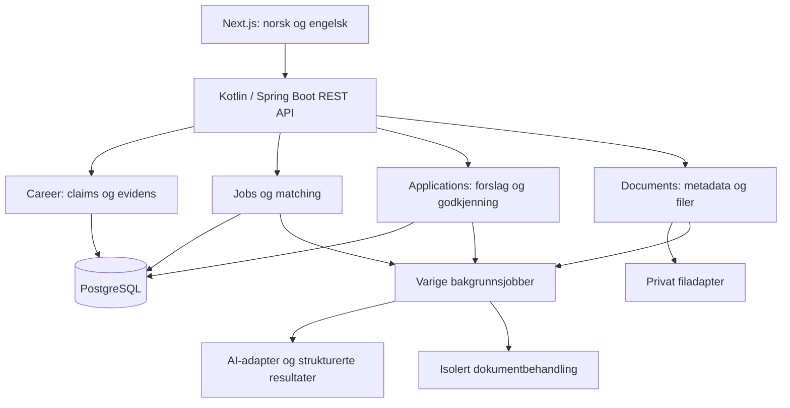

# Arkitekturgrunnlag

Status: Design for diskusjon, ikke implementert. Bekreftede føringer: modular monolith, Kotlin/Spring Boot og PostgreSQL. Konkret kjøreoppsett og versjoner velges før implementasjon. Se [ADR-indeksen](docs/adr/README.md).

## Systemgrenser

## Ansvarsdeling

| Modul | Eier | Tillatte avhengigheter |
| --- | --- | --- |
| identity | Identitet og tilgangsbeslutninger | Ingen produktmoduler |
| career | Profil, erfaring, claims, evidens, preferanser og avklaringer | identity; dokumentreferanser gjennom documents-API |
| documents | Originaler, dokumentversjoner og filmetadata | identity |
| jobs | Annonser, snapshots og krav | identity |
| matching | Vurderinger med inputversjoner og begrunnelse | career- og jobs-lesegrensesnitt; ai |
| applications | Søknadssak, innhold, godkjenning og innsending | career, matching og documents gjennom grensesnitt; ai |
| ai | Modelladaptere, resultatvalidering og kjøringsmetadata | Små oppgavekontrakter, ikke vilkårlig tilgang til domenetabeller |

Moduler oppdaterer egne data. Ingen modul endrer en annen moduls JPA-entiteter direkte. Moduloverskridende operasjoner bruker application-API-er. Unngå en stor shared-modul med domeneobjekter som alle kan skrive til.

Frontend eier presentasjon; backend eier autorisasjon og domeneregler. JPA-entiteter eksponeres ikke som REST-responser. Databasemigrasjoner versjoneres; runtime schema auto-update brukes ikke som produksjonsstrategi.

## AI og kvalitet

Arbeidsflyten styres av applikasjonen: ekstraher krav, hent autorisert grunnlag, vurder krav, valider kildehenvisninger og presenter forslag. Modellens svar er upålitelig inntil struktur og domeneregler er validert.

- Ingen direkte databaseskriving fra modellen.
- Ingen privat kandidatminne per capability.
- Lagre prompt-/modellversjon, inputreferanser og kostnadsmetadata uten rå dokumenter i logger.
- Godkjent erfaring skal ikke overdrives under omskriving eller oversettelse.
- Bruk deterministiske doubles for tester av orkestrering og et separat evalueringssett for reell modellkvalitet.
- AI-provider og lokal modellkapasitet er uavklart; ingen betalt tjeneste forutsettes.

## Varig arbeid

Dokumentbehandling og AI-kall kan vare lengre enn en HTTP-request. Registrer jobb og nødvendig domenedata i samme databasetransaksjon. Worker reserverer jobb med tidsbegrenset lease og håndterer retry, timeout og idempotens.

Eksterne kall utføres uten å holde en lang databasetransaksjon åpen. Et crash etter eksternt kall kan gi gjentatt utføring; konsistens og kostnadsgrenser må ta høyde for dette. Ikke lov exactly-once for eksterne effekter.

En prosess som venter på bruker har lagret tilstand og brukerkommandoer; den trenger ikke en kjørende tråd. Kafka og Temporal er ikke forutsatt i MVP.

## API og fremdrift

REST for kommandoer og spørringer. Jobbstatus kan i starten hentes med polling; SSE vurderes dersom behovet oppstår. Ingen WebSocket-avhengighet kreves for første leveranse.

Alle ressursoppslag inkluderer autorisert eierskap. Klientoppgitt owner-ID er aldri alene tilstrekkelig. Konkurrerende oppdateringer håndteres med versjonskontroll slik at gamle skjemaer ikke overskriver nyere bekreftelser.

## Lagring og drift

Lokal pilot er anbefalt, men avhenger av brukerens maskin. Filadapteren må skjule lokal lagring slik at privat object storage kan innføres senere. PostgreSQL er system of record; fulltekst/SQL før eventuell vector-indeks.

Originalfiler er immutable ved redigering. Konto-/dokument-sletting følger en eksplisitt personvernflyt og omfatter avledede data. Miljøsnapshot er ikke backup-strategi for brukerdata og erstatter ikke Git-versjonering.

## Tester før ferdigstatus

- Domeneinvarianter og claim-overganger.
- Integrasjonstester for persistens, autorisasjon og samtidige endringer.
- Restart/retry av varige jobber uten doble domeneresultater.
- E2E for norsk/engelsk, avklaring og versjonsbundet godkjenning.
- Realistiske DOCX/PDF-eksempler og separat kvalitetsvurdering av AI.

Testcontainers er ønsket for PostgreSQL; verifiser Docker-tilgang i faktisk utviklings-/CI-miljø før dette gjøres til et obligatorisk kjørekrav.
