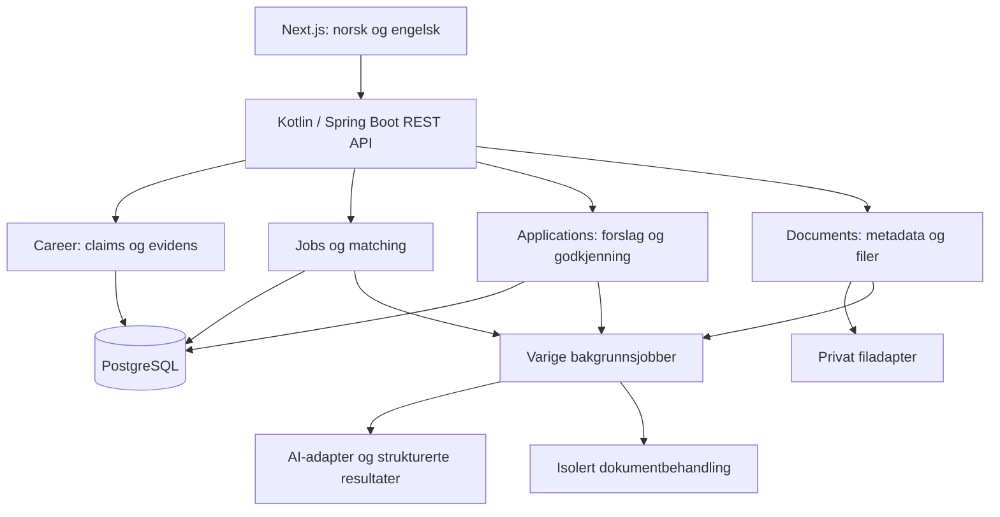
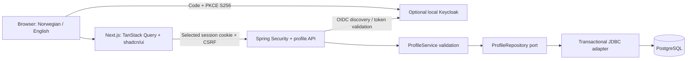

# Arkitekturgrunnlag

Status: The local pilot implements Next.js/TanStack/shadcn UI, Kotlin/Spring REST, optional PostgreSQL/Flyway and OIDC/PKCE, owned documents/claims/career history, saved advertisements, approved matching, standard CV export and manual application tracking. The current unpublished branch adds database-backed sequential document review and task-specific AI configuration. The complete target architecture below includes future workloads; see the [ADR index](docs/adr/README.md) and [pilot test guide](docs/TESTING_PILOT.md).

## Systemgrenser

## Ansvarsdeling

| Modul | Eier | Tillatte avhengigheter |
| --- | --- | --- |
| identity | Identitet og tilgangsbeslutninger | Ingen produktmoduler |
| career | Profil, erfaring, claims, evidens, preferanser og avklaringer | identity; dokumentreferanser gjennom documents-API |
| documents | Originaler, dokumentversjoner og filmetadata | identity |
| jobs | Annonser, snapshots og krav | identity |
| matching | Vurderinger med inputversjoner og begrunnelse | career- og jobs-lesegrensesnitt; ai |
| applications | Søknadssak, innhold, godkjenning og innsending | career, matching og documents gjennom grensesnitt; ai |
| ai | Modelladaptere, resultatvalidering og kjøringsmetadata | Små oppgavekontrakter, ikke vilkårlig tilgang til domenetabeller |

Moduler oppdaterer egne data. Ingen modul endrer en annen moduls JPA-entiteter direkte. Moduloverskridende operasjoner bruker application-API-er. Unngå en stor shared-modul med domeneobjekter som alle kan skrive til.

Frontend eier presentasjon; backend eier autorisasjon og domeneregler. JPA-entiteter eksponeres ikke som REST-responser. Databasemigrasjoner versjoneres; runtime schema auto-update brukes ikke som produksjonsstrategi.

## AI og kvalitet

Arbeidsflyten styres av applikasjonen: ekstraher krav, hent autorisert grunnlag, vurder krav, valider kildehenvisninger og presenter forslag. Modellens svar er upålitelig inntil struktur og domeneregler er validert.

- Ingen direkte databaseskriving fra modellen.
- Ingen privat kandidatminne per capability.
- Lagre prompt-/modellversjon, inputreferanser og kostnadsmetadata uten rå dokumenter i logger.
- Godkjent erfaring skal ikke overdrives under omskriving eller oversettelse.
- Bruk deterministiske doubles for tester av orkestrering og et separat evalueringssett for reell modellkvalitet.
- AI-provider og lokal modellkapasitet er uavklart; ingen betalt tjeneste forutsettes.

## Varig arbeid

Dokumentbehandling og AI-kall kan vare lengre enn en HTTP-request. Registrer jobb og nødvendig domenedata i samme databasetransaksjon. Worker reserverer jobb med tidsbegrenset lease og håndterer retry, timeout og idempotens.

Eksterne kall utføres uten å holde en lang databasetransaksjon åpen. Et crash etter eksternt kall kan gi gjentatt utføring; konsistens og kostnadsgrenser må ta høyde for dette. Ikke lov exactly-once for eksterne effekter.

En prosess som venter på bruker har lagret tilstand og brukerkommandoer; den trenger ikke en kjørende tråd. Kafka og Temporal er ikke forutsatt i MVP.

## API og fremdrift

REST for kommandoer og spørringer. Jobbstatus kan i starten hentes med polling; SSE vurderes dersom behovet oppstår. Ingen WebSocket-avhengighet kreves for første leveranse.

Alle ressursoppslag inkluderer autorisert eierskap. Klientoppgitt owner-ID er aldri alene tilstrekkelig. Konkurrerende oppdateringer håndteres med versjonskontroll slik at gamle skjemaer ikke overskriver nyere bekreftelser.

## Lagring og drift

Lokal pilot er anbefalt, men avhenger av brukerens maskin. Filadapteren må skjule lokal lagring slik at privat object storage kan innføres senere. PostgreSQL er system of record; fulltekst/SQL før eventuell vector-indeks.

Originalfiler er immutable ved redigering. Konto-/dokument-sletting følger en eksplisitt personvernflyt og omfatter avledede data. Miljøsnapshot er ikke backup-strategi for brukerdata og erstatter ikke Git-versjonering.

## Tester før ferdigstatus

- Domeneinvarianter og claim-overganger.
- Integrasjonstester for persistens, autorisasjon og samtidige endringer.
- Restart/retry av varige jobber uten doble domeneresultater.
- E2E for norsk/engelsk, avklaring og versjonsbundet godkjenning.
- Realistiske DOCX/PDF-eksempler og separat kvalitetsvurdering av AI.

Testcontainers er ønsket for PostgreSQL; verifiser Docker-tilgang i faktisk utviklings-/CI-miljø før dette gjøres til et obligatorisk kjørekrav.

## Implemented source and frontend boundaries

`JobImporter` validates supported links and delegates to the `VacancySource` port. `NavVacancySource` uses the official NAV vacancy API via a bounded fixed-host HTTP client, with jsoup only for normalizing its HTML description. API records use `ad_content` (verified live), despite an older example showing `json`. No Playwright scraping, Kafka or workflow infrastructure is needed.

Next.js remains the routing and backend proxy layer. TanStack Query handles service health and import/analysis mutations with no automatic AI retries. shadcn/ui components are committed as source, with Tailwind CSS tokens and a responsive workspace composition. Mutation caches are not persisted and have zero garbage-collection retention after becoming inactive; displayed content remains in component state until reload. See ADR-0009.

## FINN provider-mediated source adapter

`JobImporter` routes validated FINN links to `AdvertisementBrowser`, implemented by `GroqAdvertisementBrowser`. The adapter enables only the documented built-in `browser_search` tool; structured outputs are intentionally absent from this request. The existing structured RequirementExtractor follows retrieval from the same Analyze link action, with the configured FINN pause. Source inspection remains optional. Parse source text exclusively from exact-link `browser.open` executed_tools output, discard generated content/reasoning, and return `sourceType=GROQ_BROWSER_EXCERPT`. NAV records return `NAV_API`.

The backend communicates only with Groq's fixed HTTPS endpoint. It does not fetch FINN or other provider-returned URLs itself. Local host/path controls do not govern Groq/Exa's internal browsing. Provider access is not a blanket FINN reuse license; production terms assessment remains necessary. See ADR-0010.

## Requirement result presentation

RequirementResults is a client presentation component with category filter state. Each tile uses the official shadcn Dialog/Radix focus handling. Source context is deterministically taken from the exact analyzed snapshot with normalized whitespace and explicit clipping marks; it does not invoke AI. Generic category guidance explains the classification, without inventing role facts or candidate evidence. The backend extraction contract is unchanged.

## Opt-in storage foundation

The `persistence` Spring profile enables JDBC/PostgreSQL and Flyway. Default public-ad analysis excludes database auto-configuration and retains its previous startup behavior. Local Compose is pinned to an official PostgreSQL 17 image digest. Initial identity/profile tables model unique OIDC issuer/subject bindings, profile ownership, language and revision. An optional OIDC session now protects the owned basic-profile API; reviewed claims and local document/source import are implemented on this branch. Foreign keys do not replace authorization. See ADR 0011 and docs/POSTGRES_SETUP.md.

## Implemented local identity and profile boundary

The `identity` profile enables OIDC login; `persistence` enables the repository. Private routes resolve `(issuer, subject)` exclusively from the verified principal, never a caller-supplied owner. One profile per owner is enforced in PostgreSQL and scoped in every repository query. Writes serialize on the identity binding and compare the submitted revision. The original basic-profile increment stored name/language; the current branch adds claims and documents as described below. Fixed Next proxies enforce local/same-origin requests, bounded JSON and no-store responses. HTTP session/CSRF state is held by Spring, not localStorage. Public ad analysis remains independent and never receives profile data. See ADR 0013 and docs/IDENTITY_SETUP.md.

Development advertisement diagnostics use a nonmodal shadcn Sheet opened from the fixed right DEV tab. The workspace owns current-run state; opening/closing the panel does not restart analysis or make provider calls.

## Reviewed competencies and local source documents

The profile module adds domain status/revision policies, an application service/repository port, transactional JDBC adapter and owned REST API. Owner writes serialize on the identity binding; edits/reviews use expected revisions. The documents module uses a storage port with a local filesystem adapter, JDBC metadata/text and bounded local text extraction. Document-selected claims are created through ClaimService and remain UNVERIFIED. Composite foreign keys protect ownership of source links; every read/download/write also verifies the OIDC principal.

Next private proxies enforce same origin, selected cookies/CSRF, bounded multipart/JSON bodies and no-store. TanStack Query and existing shadcn Cards/Dialogs render CV inspection and claim review. Private candidate material never enters the public AI workflow or DEV diagnostics. Storage is local for the pilot; object-store production adapters, crash reconciliation and backup policies are separate work. See ADR 0014/0015.

The job overview displays original source quotations in narrative sections; practical metadata remains inspectable. A failed structured AI result retains and displays the fetched/pasted advertisement with honest unstructured status. The diagnostic reason is an allowlisted category, not a raw model response. FINN still uses browser retrieval followed by structured analysis; no combined tool/JSON call has been introduced.

## Opt-in document AI analysis (ADR 0016)

Authenticated private Next routes forward only the reviewed text previews, locale and explicit submission approval to the documents capability. DocumentAnalysisService verifies issuer+subject ownership, enforces 20-document/12,000-character and shared document-attempt/concurrency limits, calls AiModel once without tools and validates every quote against both the submitted preview and its identified owned source. It never loads profile/claim content into the prompt. Persist validated individual or combined results through DocumentAnalysisRepository; do not hold a database transaction across model I/O. Recheck document existence when saving and serialize collection persistence with document writes.

TanStack queries load stored summaries without invoking AI. Mutations have no automatic retry, retain failed previews/previous summaries and respect Retry-After. Selected proposals populate editable source-claim fields; saving is UNVERIFIED with a separate confirmation workflow. Native details/Card/Dialog primitives preserve Norwegian/English and narrow-screen access. Public ad endpoints and diagnostics remain independent. No new runtime service or dependency is added.

## Competency/source workspace and local reading recovery (ADR 0017)

Use searchable status-filtered recorded claims, derived counts and a document library with extracted character counts. A shadcn Sheet separates AI source approval from sourced results. Pure bounded excerpt selection redistributes unused document shares and spreads long selections across beginning/middle/end. This is selected coverage, not exhaustive retrieval. The existing single provider call can return up to twenty concise proposals. Item-level validation retains supported items, caps displayed summaries/proposals and reports omitted malformed/excess items rather than discarding the entire result. Empty context is explicitly unknown; invalid root JSON/schema or all-unsupported results remain errors. Whitespace-only quote matching maps back to an exact original substring; factual rewrites remain unsupported.

The owned reread command accepts an OCR boolean and reads existing immutable original bytes. Ordinary DOCX/PDF extraction is local; optional textless-page OCR uses PDFBox rasterization and a fixed local Tesseract subprocess with limits, private temporary files and a reduced environment. No provider request occurs. V5 stores extraction method; character counts are derived from current source text. Changed source text invalidates stored single/collection analyses; source snapshots are checked again before saving an in-flight AI result. Existing user-confirmed claims/history are independent of re-extraction and remain preserved. Production worker isolation/storage policy remains future work.

## Owned job workflow (ADR 0018)

The jobs module now has immutable SavedJob snapshots and a private PersonalMatch capability. ObjectProvider keeps public startup database independent. Private Next routes pass only validated session/CSRF and bounded JSON; server repositories resolve owner by verified issuer/subject. V6/V7 transactions protect snapshot limits/deduplication and in-flight claim revision checks. Matching uses AiModel with one approved call and no public-ad diagnostics, scores, events or independent agent memory. See docs/SAVED_JOBS.md and docs/MATCHING.md.

## Entry and reviewed history increment

Next.js separates public landing, dedicated sign-in, guest analysis and an authenticated workspace overview without introducing another router or identity provider. Frontend session guards prevent unnecessary private mounts; Spring ownership/CSRF remains authoritative. Fixed OIDC success/failure destinations are dashboard/sign-in. Shared sign-out clears private TanStack caches. The overview is a deterministic projection of owned profile/claims/saved jobs and makes no model call. ADR 0020 and docs/UX_DESIGN.md record the route/design contract.

The profile module now owns typed reviewed career entries and revision history in PostgreSQL V8, using existing owner locking and expected revisions. This supplies a small truthful history model for later CV snapshots without a new broker, ORM or extraction agent. ADR 0019 records its boundaries.

## Local pilot CV and application modules

`cv` owns standard draft/artifact generation and approval. `applications` owns manual application cases and material references. Both use authenticated private proxies, PostgreSQL owner locks/revisions and owned foreign keys. Original document storage is reused for generated artifacts; failed deletion is journaled and retried by CSRF-protected POST. No new event broker/workflow engine is introduced. Advertisement text can be organized locally from explicit headings/labelled fields without an AI call. Document evidence is stored separately from deduplicated claim wording. See ADRs 0021/0022 and the feature guides for bounds and remaining production work.

## Source-selected document knowledge (ADR 0023)

Reviewed text is encoded as bounded numbered literal passages. Groq selects evidence IDs, skill labels and optional same-document header context; application code supplies source wording and validates source membership, literal skill boundaries and nearby section proof. The original API/storage result shape stays compatible through optional contextQuote. Older results are revalidated on read without rewriting claims/history. Read-only owned document checks compare original size/hash, fresh local extraction and stored quotation support without a provider call or database write. Green checks never certify interpretation/completeness.

## Bounded document orchestration

The browser submits approved full previews once, then dispatches one private `/documents/workflow/{id}/next` step at a time. PostgreSQL stores progress; revision replay, owner locks and a short processing lease protect against duplicate calls/imports. Successful steps persist usable drafts. Provider rejection pauses progress and preserves the full reported cooldown. Closing the UI stops further dispatch; reopening requires explicit continuation. An in-flight request can finish and save its result. This is a local-pilot workflow, not a background queue or Temporal implementation.

Stable task prompts/schema precede variable numbered evidence. `AiTask` selects a configurable provider model; current defaults remain unchanged. Strict JSON validates shape, independent evidence checks validate literal provenance, and user review determines factual confirmation. No model can directly modify authoritative career history. See [GROQ_OPTIMIZATION.md](docs/GROQ_OPTIMIZATION.md).
