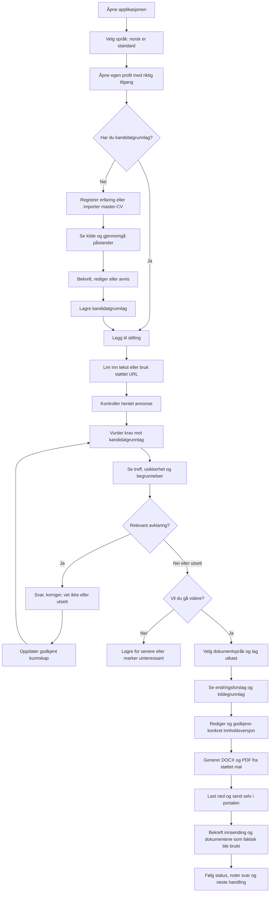
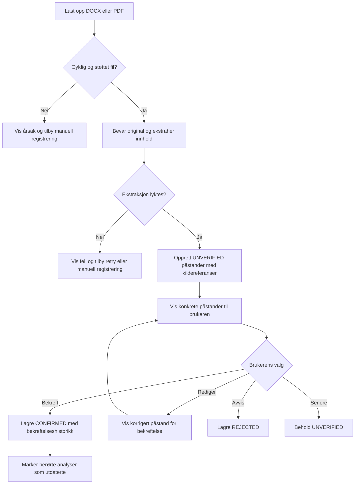
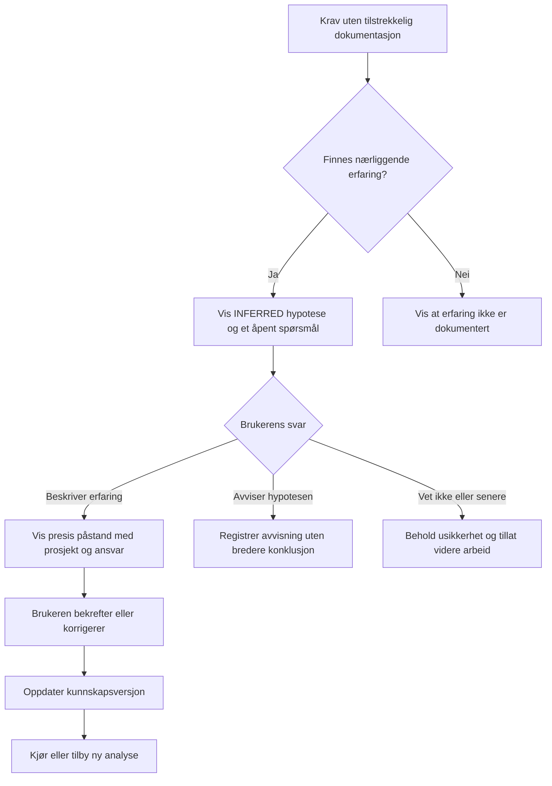
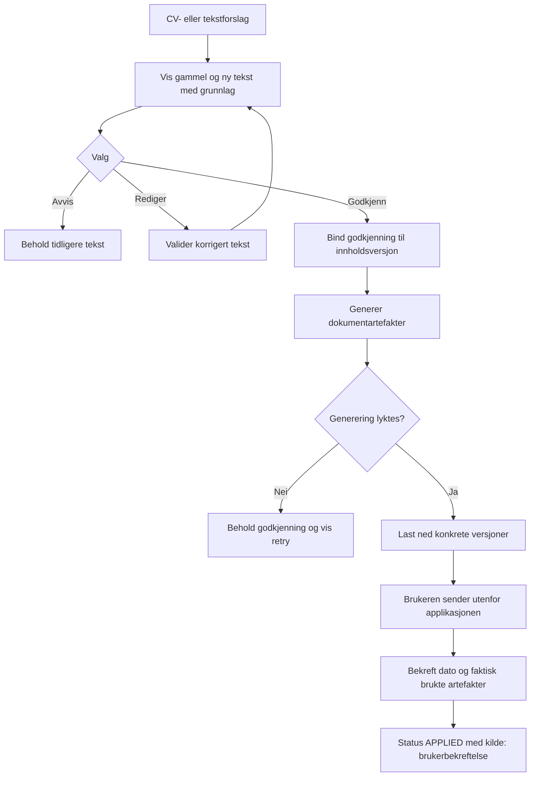
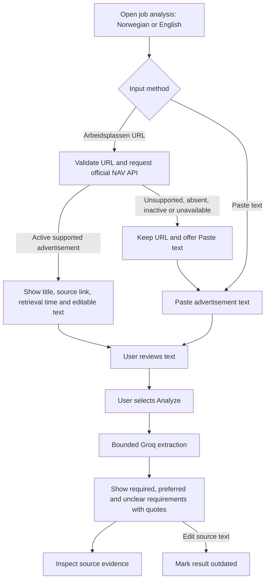
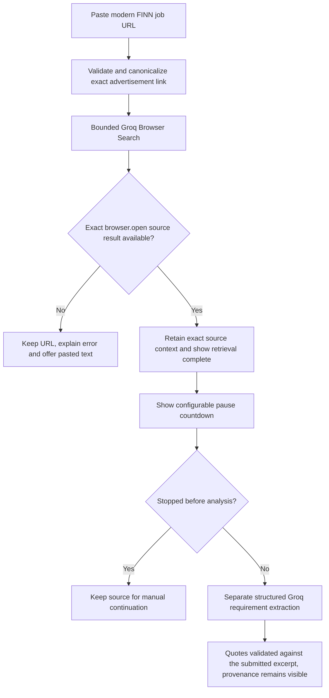
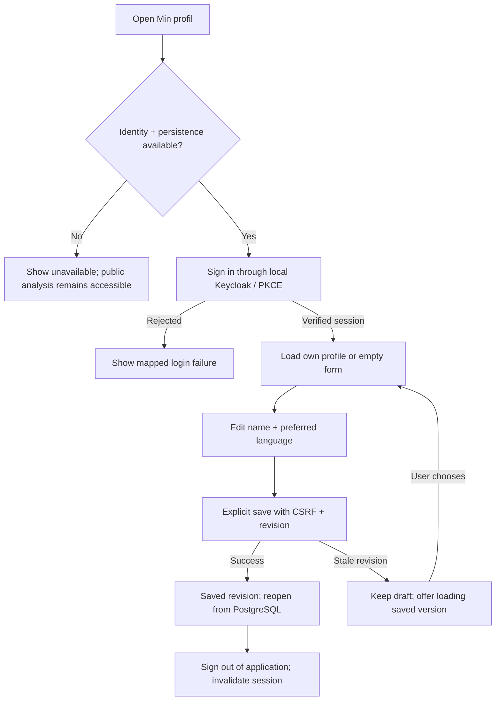
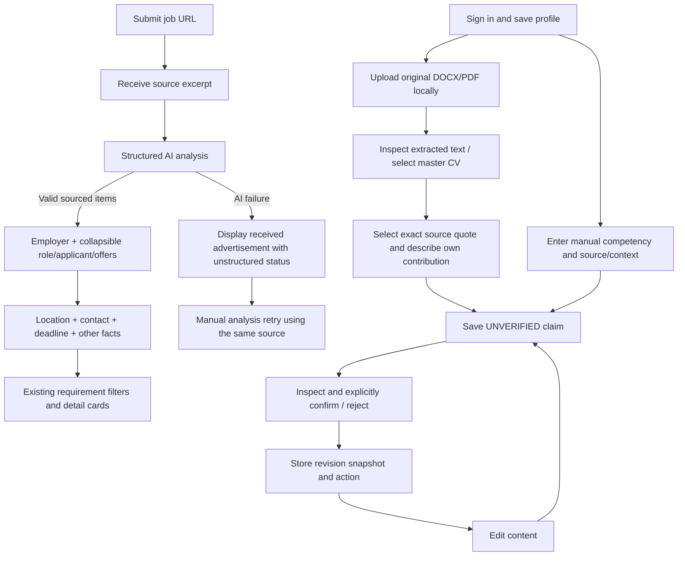

# Brukerflyter

Status: Proposed full MVP flows. The full flows below are not implemented. A bounded public-advertisement flow (US-23) is available on feat/job-requirements: paste text → explicitly send to Groq → inspect categories and source quotations → edit/retry. It has no candidate matching or persistence. Story IDs refer to [USER_STORIES.md](USER_STORIES.md).

## 1. Fra første besøk til søknad

Story-dekning: US-01 til US-14. Tilgangsmodellen for den lokale piloten er uavklart; en flerbrukerversjon krever verifisert innlogging og isolasjon.

## 2. Fra dokument til godkjent påstand

En brukerbekreftelse er ikke det samme som ekstern dokumentasjon. Kildetype og bekreftelse må vises separat. Avvisning betyr ikke automatisk at kandidaten mangler ferdigheten.

## 3. Kompetanseavklaring

Brukeren skal kunne vende tilbake til ubesvarte spørsmål. En uavklart hypotese kan ikke brukes som bekreftet erfaring i eksportert materiale.

## 4. Godkjenning og faktisk innsending

Generering eller nedlasting betyr ikke innsending. Hvis brukeren endrer dokumentet eksternt, må løsningen støtte å registrere den endelige filen; ellers merkes eksakt innsendt versjon som ukjent.

## Feil, avbrudd og retur

| Situasjon | Ønsket brukeropplevelse |
| --- | --- |
| URL-henting feiler | Behold URL og tilby innlimt annonsetekst. |
| AI utilgjengelig eller budsjettgrense nådd | Behold brukerdata og tilby senere retry; manuell profil/CRM fungerer videre. |
| Utdrag er feil eller kilder motsier hverandre | Vis avklaring; ikke overskriv bekreftet kunnskap automatisk. |
| Brukeren lukker siden | Lagrede utkast og spørsmål kan gjenopptas; vis hva som eventuelt ikke ble lagret. |
| Kandidatgrunnlag endres | Marker analysen som utdatert; behold tidligere analysehistorikk. |
| Annonse endres eller fjernes | Behold snapshot brukt i analysen og vis kilde/tidspunkt. |
| Godkjent tekst redigeres | Ny innholdsversjon krever ny godkjenning. |
| Dokumentgenerering feiler | Ingen ferdigstatus; bevar utkast og tilby retry. |

## Fremtidig flyt, utenfor MVP

Automatisk discovery fører inn i «Legg til stilling». Browser-assistent kan senere erstatte den manuelle portalhandlingen, men må vise endelig innhold og dokumenter før eksplisitt godkjenning av innsending. Intervju og oppfølging bygger på søknadssaken og det faktisk sendte materialet.

## Implemented pilot flow: URL review and requirement extraction

The pilot does not save input or results across reload. NAV URL import makes no AI call. FINN import uses one Groq Browser Search API call before review, with its own bounded attempt limit. A fetched page is never automatically sent to Groq; the user reviews normalized text first. API-returned application links are not fetched. The current interface does not offer automated submission or personal match scores.

## FINN source branch

The excerpt is provider-mediated source context, not the model's generated summary, a complete advertisement guarantee, or independently verified live source data. The website's update time and ad's active status are not established by a successful provider read.

## Compact requirement inspection (implemented, PR merge pending)

Analyze source → view category counts and grouped tiles → optionally filter category → select a requirement → shadcn Dialog with original quote, category guidance and surrounding submitted-source context → close/Escape and return focus to the selected tile. Editing input retains the existing stale-result warning. Browser-excerpt provenance also appears in details. Inspecting/filtering creates no additional provider request.

## Direct URL analysis and sourced job overview (2026-10-07)

Selecting **Analyze link** retrieves and analyzes the public advertisement in one action. FINN retrieval is followed by a configurable 10-second pause before structured analysis; NAV normally skips it. The previous mandatory import/review step is superseded by the product owner's explicit instruction. Manual pasted text remains editable. Retrieval and analysis each keep their existing concurrency, quota, validation and error boundaries; there are no automatic retries. If analysis fails after retrieval, the text remains available for retry without another search.

The overview contains up to ten useful, variable facts: employer description, role/responsibilities, deadline, location/work model, contacts, benefits, salary or application process when explicitly present. Every fact carries a verbatim source quote. Missing data is omitted with an explicit notice rather than guessed. Quote membership validation establishes provenance, not semantic correctness of the AI's paraphrase. Browser excerpts can still be partial/stale; this limitation and the original link remain visible. Full source text is expandable, not a required intermediate screen. Requirement tiles/details remain unchanged.

No candidate matching, private profile storage or company research is implied by this overview. All extracted facts are AI suggestions from the advertisement. Existing source quotes and optional source review remain available; older mandatory review instructions do not apply to this flow.

## Client initialization boundary

Initial server-rendered analysis controls are disabled until React initializes. Then mode selection and URL/text submission are enabled. Submissions run through TanStack mutations and prevent native document navigation. Failed retrieval/analysis keeps input and displays a mapped error. No advertisement, profile or API key is persisted in browser storage by this change.

## Evidence failures and free-tier retries

A valid FINN browser excerpt may have a wrapped site title; presentation emphasis is normalized before analysis. Valid independently cited cards remain visible if another suggestion lacks source evidence, with a visible omission notice. Entirely unsupported or malformed results still fail closed.

After a provider token-rate rejection, show a bounded countdown and keep the URL/text. A manual retry for the same retrieved URL analyzes the current text without a new browser search. Different URLs fetch fresh content. No automatic retries are made; process call limits and exact-source checks remain. Switching input mode/reading/editing remain available during a reactive quota cooldown. Controls are disabled during the active retrieval/pacing/analysis sequence; the explicit Stop action is available during pacing.

## Development inspection and paced loading

Submit URL → retrieval status → received-source success → FINN pause/countdown (or skipped for NAV) → analysis status → sourced overview and compact requirement cards. Stopping during the pause retains the source and cancels the scheduled analysis; same-URL continuation respects any remaining pause. There is no invented progress percentage or model call for the decorative animation.

Development: open the DEV edge tab on the right to reveal the shadcn Sheet → inspect labeled green/yellow/red/gray stage lights, HTTP status, elapsed time and counts → optionally expand the received source text. Console shows the same sanitized events under `[Career Agent]`; no source bodies or provider secrets are logged. Reload clears in-memory state. Diagnostics are hidden in production unless explicitly enabled before build. See docs/DEBUGGING.md.

## Implemented basic profile flow (US-28; current branch)

The form supports Norwegian/English. Ownership is never selected by the browser. Unauthenticated/expired sessions cannot read or write a profile. App restart requires sign-in again, while saved data remains. This initial flow covers the basic profile; reviewed claims and local CV import are added by the implemented flow below. Personal matching remains future work. Setup is in docs/IDENTITY_SETUP.md. Proposed full MVP flows above remain future work.

## Current branch: source overview, reviewed competencies and CV import

Contact always has a slot, with an honest not-identified state when analysis does not supply it. A failed analysis never replaces available source text with an empty result screen. No private profile/CV material is sent to Groq. Source selection creates a proposal, not confirmed truth. Permanent document deletion explains retained claim quotes; permanent claim deletion removes its history. Login/session expiry, revision conflicts, malformed/oversized files, encrypted PDFs and empty/scanned text have visible states. See docs/CV_IMPORT.md for the bounded import scope.
