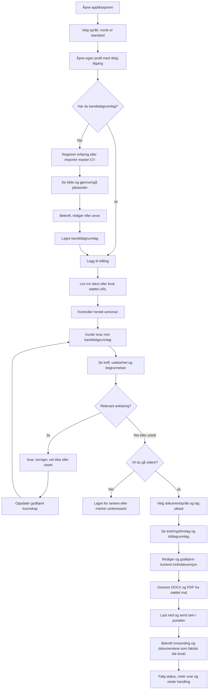
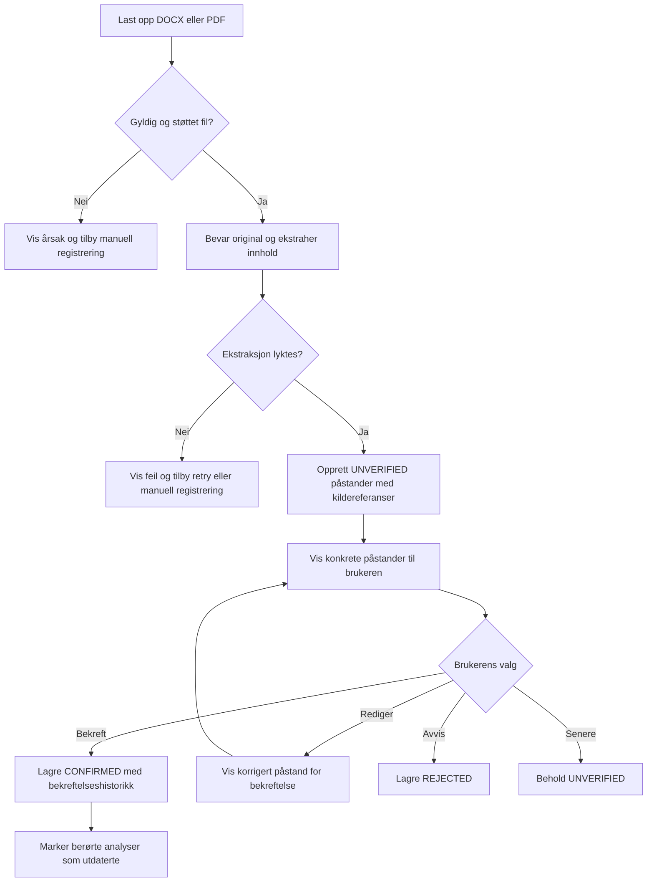
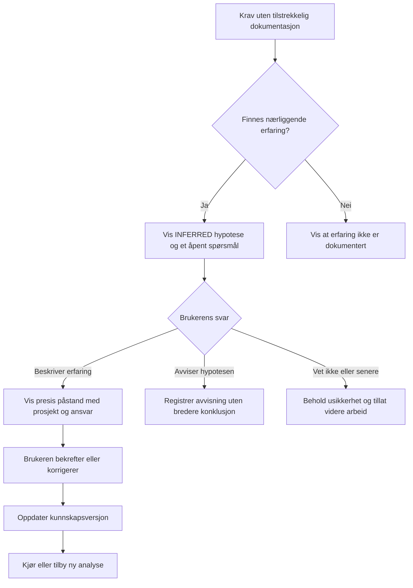
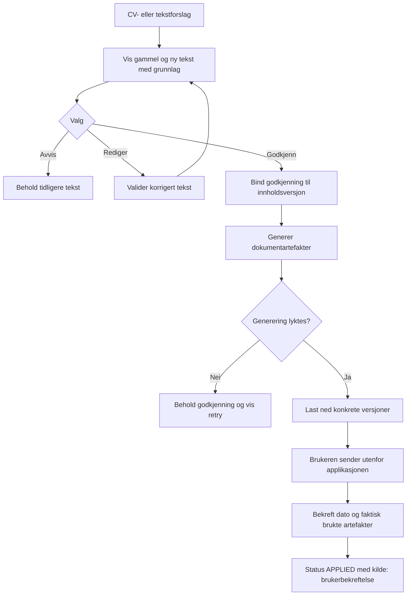
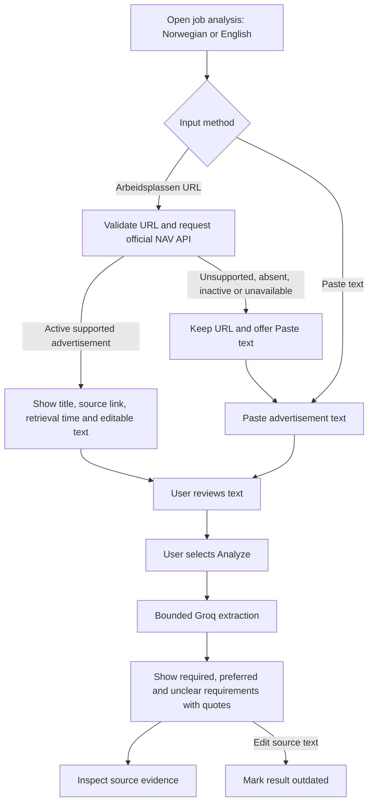
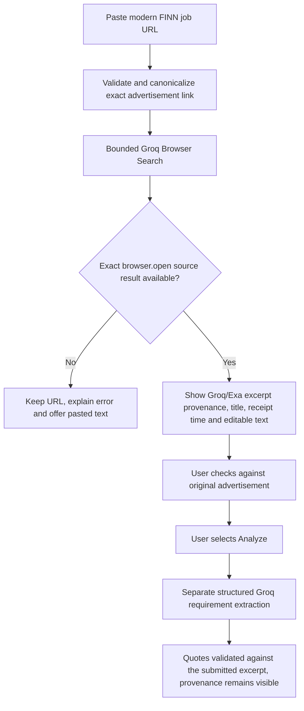

# Brukerflyter

Status: Proposed full MVP flows. The full flows below are not implemented. A bounded public-advertisement flow (US-23) is available on feat/job-requirements: paste text → explicitly send to Groq → inspect categories and source quotations → edit/retry. It has no candidate matching or persistence. Story IDs refer to [USER_STORIES.md](USER_STORIES.md).

## 1. Fra første besøk til søknad

Story-dekning: US-01 til US-14. Tilgangsmodellen for den lokale piloten er uavklart; en flerbrukerversjon krever verifisert innlogging og isolasjon.

## 2. Fra dokument til godkjent påstand

En brukerbekreftelse er ikke det samme som ekstern dokumentasjon. Kildetype og bekreftelse må vises separat. Avvisning betyr ikke automatisk at kandidaten mangler ferdigheten.

## 3. Kompetanseavklaring

Brukeren skal kunne vende tilbake til ubesvarte spørsmål. En uavklart hypotese kan ikke brukes som bekreftet erfaring i eksportert materiale.

## 4. Godkjenning og faktisk innsending

Generering eller nedlasting betyr ikke innsending. Hvis brukeren endrer dokumentet eksternt, må løsningen støtte å registrere den endelige filen; ellers merkes eksakt innsendt versjon som ukjent.

## Feil, avbrudd og retur

| Situasjon | Ønsket brukeropplevelse |
| --- | --- |
| URL-henting feiler | Behold URL og tilby innlimt annonsetekst. |
| AI utilgjengelig eller budsjettgrense nådd | Behold brukerdata og tilby senere retry; manuell profil/CRM fungerer videre. |
| Utdrag er feil eller kilder motsier hverandre | Vis avklaring; ikke overskriv bekreftet kunnskap automatisk. |
| Brukeren lukker siden | Lagrede utkast og spørsmål kan gjenopptas; vis hva som eventuelt ikke ble lagret. |
| Kandidatgrunnlag endres | Marker analysen som utdatert; behold tidligere analysehistorikk. |
| Annonse endres eller fjernes | Behold snapshot brukt i analysen og vis kilde/tidspunkt. |
| Godkjent tekst redigeres | Ny innholdsversjon krever ny godkjenning. |
| Dokumentgenerering feiler | Ingen ferdigstatus; bevar utkast og tilby retry. |

## Fremtidig flyt, utenfor MVP

Automatisk discovery fører inn i «Legg til stilling». Browser-assistent kan senere erstatte den manuelle portalhandlingen, men må vise endelig innhold og dokumenter før eksplisitt godkjenning av innsending. Intervju og oppfølging bygger på søknadssaken og det faktisk sendte materialet.

## Implemented pilot flow: URL review and requirement extraction

The pilot does not save input or results across reload. NAV URL import makes no AI call. FINN import uses one Groq Browser Search API call before review, with its own bounded attempt limit. A fetched page is never automatically sent to Groq; the user reviews normalized text first. API-returned application links are not fetched. The current interface does not offer automated submission or personal match scores.

## FINN source branch

The excerpt is provider-mediated source context, not the model's generated summary, a complete advertisement guarantee, or independently verified live source data. The website's update time and ad's active status are not established by a successful provider read.

## Compact requirement inspection (implemented, PR merge pending)

Analyze source → view category counts and grouped tiles → optionally filter category → select a requirement → shadcn Dialog with original quote, category guidance and surrounding submitted-source context → close/Escape and return focus to the selected tile. Editing input retains the existing stale-result warning. Browser-excerpt provenance also appears in details. Inspecting/filtering creates no additional provider request.
