# Brukerflyter

Status: The complete future flows below remain a design. The merged local pilot supports public URL/text analysis and optional authenticated profile/documents, saved jobs, approved matching, reviewed CV export and manual application tracking. The maintenance slice retains valid cited items when other AI fields fail and preserves long quota waits. Story IDs refer to [USER_STORIES.md](USER_STORIES.md).

Maintenance recovery: source retrieved → analyze once → retain valid cited items and report omissions. If the whole response is unusable or quota is reached, keep the source reader and any previous valid result. A quota response establishes a shared backend cooldown; proxies/UI preserve the duration and no automatic retry occurs. Existing saved analyses can be reopened without another provider call. A new manual attempt after the wait may still exceed the provider quota.

## 1. Fra første besøk til søknad

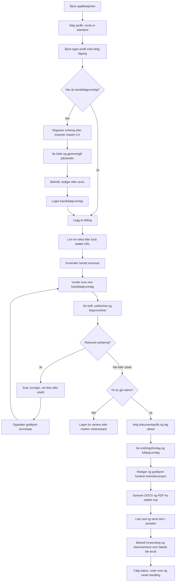

Story-dekning: US-01 til US-14. Tilgangsmodellen for den lokale piloten er uavklart; en flerbrukerversjon krever verifisert innlogging og isolasjon.

## 2. Fra dokument til godkjent påstand

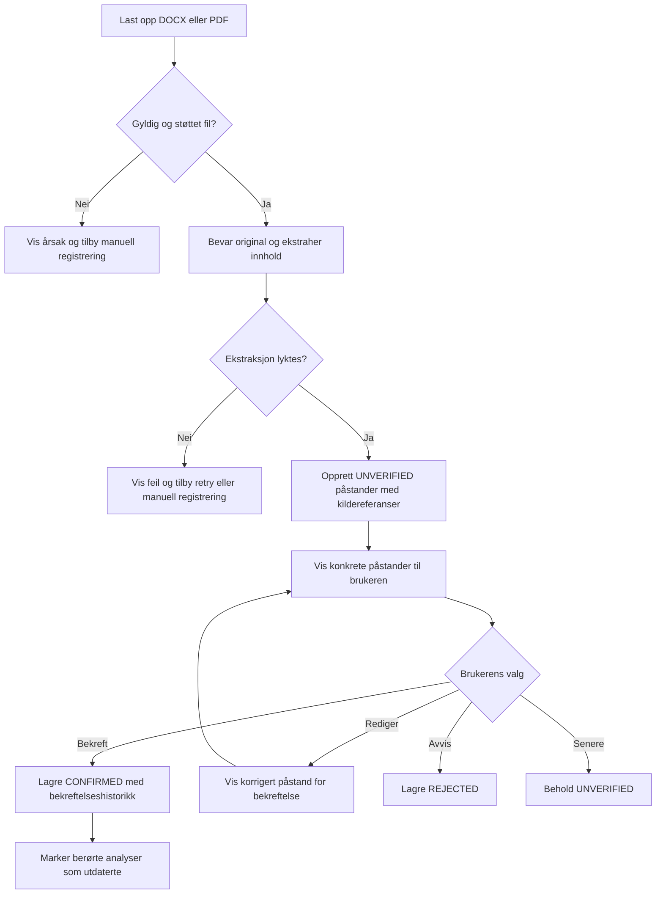

En brukerbekreftelse er ikke det samme som ekstern dokumentasjon. Kildetype og bekreftelse må vises separat. Avvisning betyr ikke automatisk at kandidaten mangler ferdigheten.

## 3. Kompetanseavklaring

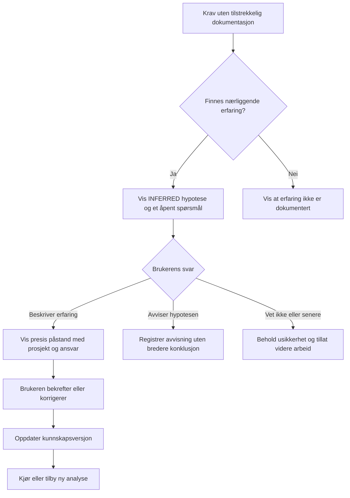

Brukeren skal kunne vende tilbake til ubesvarte spørsmål. En uavklart hypotese kan ikke brukes som bekreftet erfaring i eksportert materiale.

## 4. Godkjenning og faktisk innsending

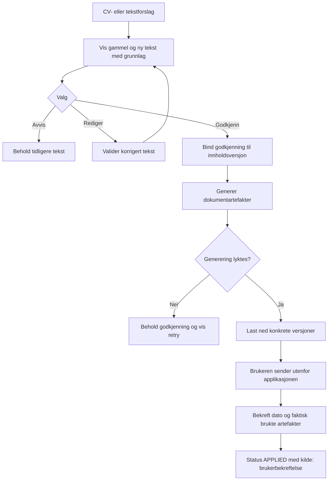

Generering eller nedlasting betyr ikke innsending. Hvis brukeren endrer dokumentet eksternt, må løsningen støtte å registrere den endelige filen; ellers merkes eksakt innsendt versjon som ukjent.

## Feil, avbrudd og retur

| Situasjon | Ønsket brukeropplevelse |
| --- | --- |
| URL-henting feiler | Behold URL og tilby innlimt annonsetekst. |
| AI utilgjengelig eller budsjettgrense nådd | Behold brukerdata og tilby senere retry; manuell profil/CRM fungerer videre. |
| Utdrag er feil eller kilder motsier hverandre | Vis avklaring; ikke overskriv bekreftet kunnskap automatisk. |
| Brukeren lukker siden | Lagrede utkast og spørsmål kan gjenopptas; vis hva som eventuelt ikke ble lagret. |
| Kandidatgrunnlag endres | Marker analysen som utdatert; behold tidligere analysehistorikk. |
| Annonse endres eller fjernes | Behold snapshot brukt i analysen og vis kilde/tidspunkt. |
| Godkjent tekst redigeres | Ny innholdsversjon krever ny godkjenning. |
| Dokumentgenerering feiler | Ingen ferdigstatus; bevar utkast og tilby retry. |

## Fremtidig flyt, utenfor MVP

Automatisk discovery fører inn i «Legg til stilling». Browser-assistent kan senere erstatte den manuelle portalhandlingen, men må vise endelig innhold og dokumenter før eksplisitt godkjenning av innsending. Intervju og oppfølging bygger på søknadssaken og det faktisk sendte materialet.

## Implemented pilot flow: URL review and requirement extraction

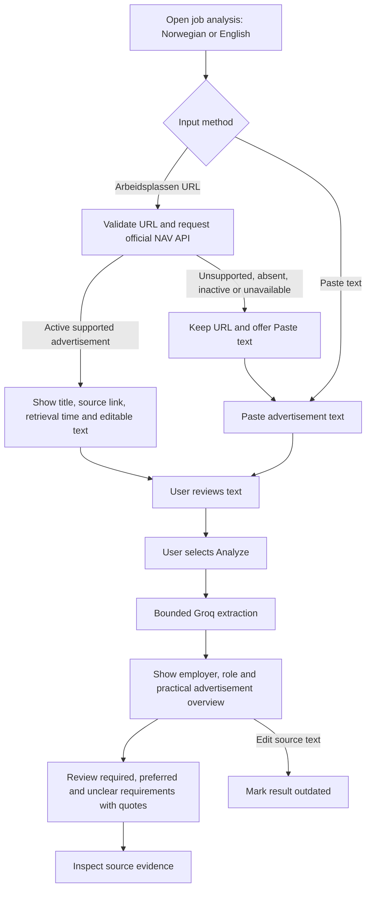

The result places the employer/role overview, applicant profile, offered benefits and practical details (location, contact and deadline) before requirement cards. Literal labeled practical fields may fill an otherwise missing extracted fact; other unknowns remain explicit. Applicant and offer excerpts have compact previews with scrollable source readers. Full source wording is expandable and stays distinct from AI-extracted requirements. If source-backed suggestions were omitted, the user sees the count and can inspect the received text, add a manually labeled detail with a verbatim source quote, and remove it again. Manual details stay in the current page session and are persisted only when the user explicitly saves the job snapshot; they never create another AI call or alter the omitted count. Retrieval and requirement analysis have separate model choices and approval fingerprints. NAV URL import makes no AI call. FINN retrieval offers Groq Browser Search or Gemini 3.8 Flash URL Context. The Gemini result requires successful retrieval plus a citation to the exact requested URL and remains labeled as an AI-prepared excerpt, not original page text. Missing/mismatched evidence remains `SOURCE_NOT_AVAILABLE`; there is no automatic provider switch. The pilot does not save input or results across reload unless the user saves a job snapshot. API-returned application links are not fetched. The current interface does not offer automated submission or personal match scores.

## FINN source branch

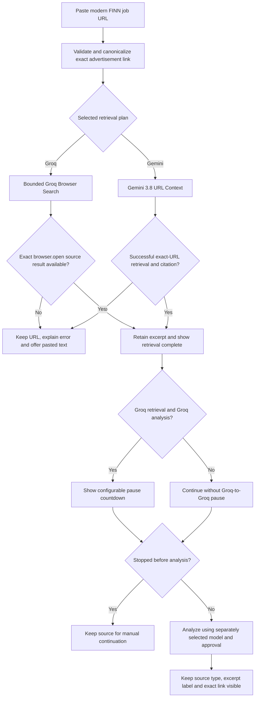

The excerpt is provider-mediated source context, not the model's generated summary, a complete advertisement guarantee, or independently verified live source data. A citation check establishes URL attribution, not semantic completeness or correctness. The website's update time and ad's active status are not established by a successful provider read.

## Compact requirement inspection (implemented, PR merge pending)

Analyze source → view category counts and grouped tiles → optionally filter category → select a requirement → shadcn Dialog with original quote, category guidance and surrounding submitted-source context → close/Escape and return focus to the selected tile. Editing input retains the existing stale-result warning. Browser-excerpt provenance also appears in details. Inspecting/filtering creates no additional provider request.

## Direct URL analysis and sourced job overview (2026-10-07)

Selecting **Analyze link** retrieves and analyzes the public advertisement in one action. FINN retrieval is followed by a configurable 10-second pause before structured analysis; NAV normally skips it. The previous mandatory import/review step is superseded by the product owner's explicit instruction. Manual pasted text remains editable. Retrieval and analysis each keep their existing concurrency, quota, validation and error boundaries; there are no automatic retries. If analysis fails after retrieval, the text remains available for retry without another search.

The overview contains up to ten useful, variable facts: employer description, role/responsibilities, deadline, location/work model, contacts, benefits, salary or application process when explicitly present. Every fact carries a verbatim source quote. Missing data is omitted with an explicit notice rather than guessed. Quote membership validation establishes provenance, not semantic correctness of the AI's paraphrase. Browser excerpts can still be partial/stale; this limitation and the original link remain visible. Full source text is expandable, not a required intermediate screen. Requirement tiles/details remain unchanged.

No candidate matching, private profile storage or company research is implied by this overview. All extracted facts are AI suggestions from the advertisement. Existing source quotes and optional source review remain available; older mandatory review instructions do not apply to this flow.

## Client initialization boundary

Initial server-rendered analysis controls are disabled until React initializes. Then mode selection and URL/text submission are enabled. Submissions run through TanStack mutations and prevent native document navigation. Failed retrieval/analysis keeps input and displays a mapped error. No advertisement, profile or API key is persisted in browser storage by this change.

## Evidence failures and free-tier retries

A valid FINN browser excerpt may have a wrapped site title; presentation emphasis is normalized before analysis. Valid independently cited cards remain visible if another suggestion lacks source evidence, with a visible omission notice. Entirely unsupported or malformed results still fail closed.

After a provider token-rate rejection, show a bounded countdown and keep the URL/text. A manual retry for the same retrieved URL analyzes the current text without a new browser search. Different URLs fetch fresh content. No automatic retries are made; process call limits and exact-source checks remain. Switching input mode/reading/editing remain available during a reactive quota cooldown. Controls are disabled during the active retrieval/pacing/analysis sequence; the explicit Stop action is available during pacing.

## Development inspection and paced loading

Submit URL → retrieval status → received-source success → FINN pause/countdown (or skipped for NAV) → analysis status → sourced overview and compact requirement cards. Stopping during the pause retains the source and cancels the scheduled analysis; same-URL continuation respects any remaining pause. There is no invented progress percentage or model call for the decorative animation.

Development: open the DEV edge tab on the right to reveal the shadcn Sheet → inspect labeled green/yellow/red/gray stage lights, HTTP status, elapsed time and counts → optionally expand the received source text. Console shows the same sanitized events under `[Career Agent]`; no source bodies or provider secrets are logged. Reload clears in-memory state. Diagnostics are hidden in production unless explicitly enabled before build. See docs/DEBUGGING.md.

## Implemented basic profile flow (US-28; current branch)

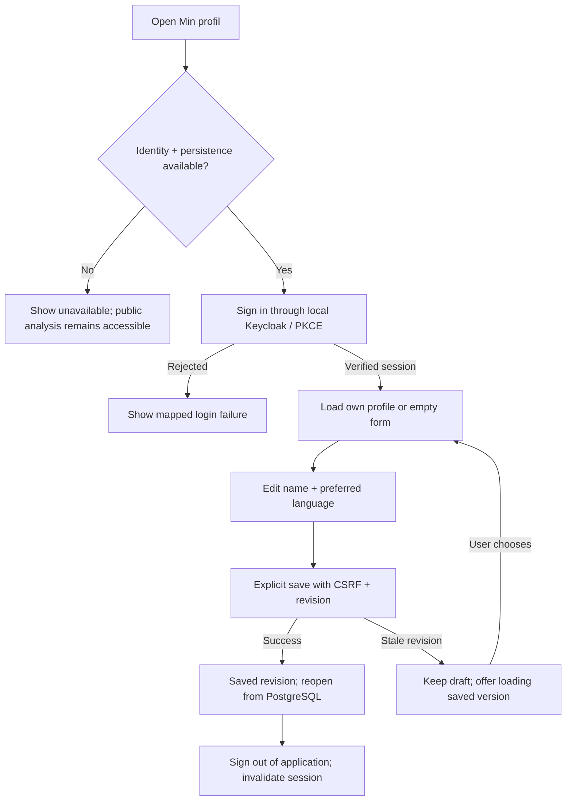

The form supports Norwegian/English. Ownership is never selected by the browser. Unauthenticated/expired sessions cannot read or write a profile. App restart requires sign-in again, while saved data remains. This initial flow covers the basic profile; reviewed claims and local CV import are added by the implemented flow below. Personal matching remains future work. Setup is in docs/IDENTITY_SETUP.md. Proposed full MVP flows above remain future work.

## Current branch: source overview, reviewed competencies and CV import

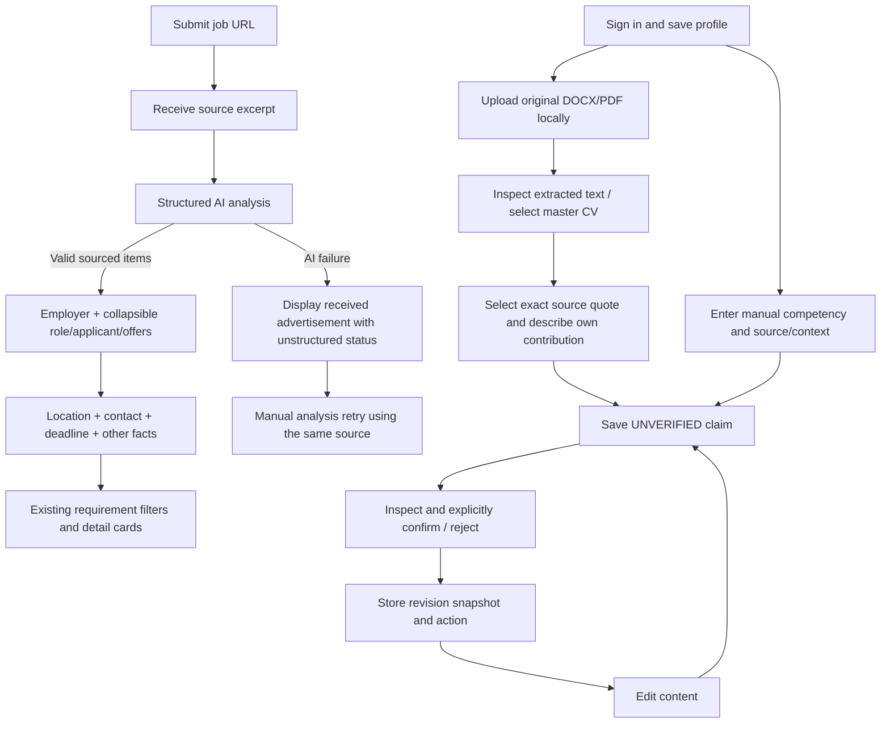

Contact always has a slot, with an honest not-identified state when analysis does not supply it. A failed analysis never replaces available source text with an empty result screen. No private profile/CV material is sent to Groq. Source selection creates a proposal, not confirmed truth. Permanent document deletion explains retained claim quotes; permanent claim deletion removes its history. Login/session expiry, revision conflicts, malformed/oversized files, encrypted PDFs and empty/scanned text have visible states. See docs/CV_IMPORT.md for the bounded import scope.

## Implemented optional document AI flow (ADR 0016)

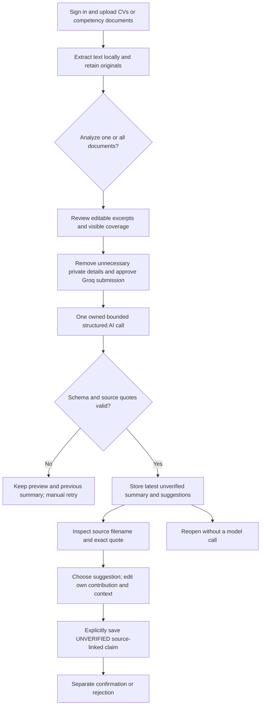

Unreadable scans are visibly excluded; long documents share a bounded excerpt budget. Reanalysis does not change saved claims. A source upload/deletion clears the combined summary. No original binaries, filenames or other profile content enter the provider prompt; private source previews are not advertisement diagnostics.

## Competency workspace and document recovery (ADR 0017)

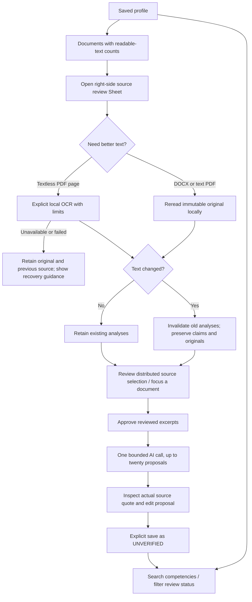

Regular uploads do not invoke OCR or AI. OCR is optional and cannot promise complete reading of mixed text/image layouts. Distributed excerpts include later passages but remain limited; source selection and another approved call can target missing sections. Whitespace changes never authorize changed words. Saved claims remain separate from replaceable AI suggestion snapshots.

## Local job library and personal matching

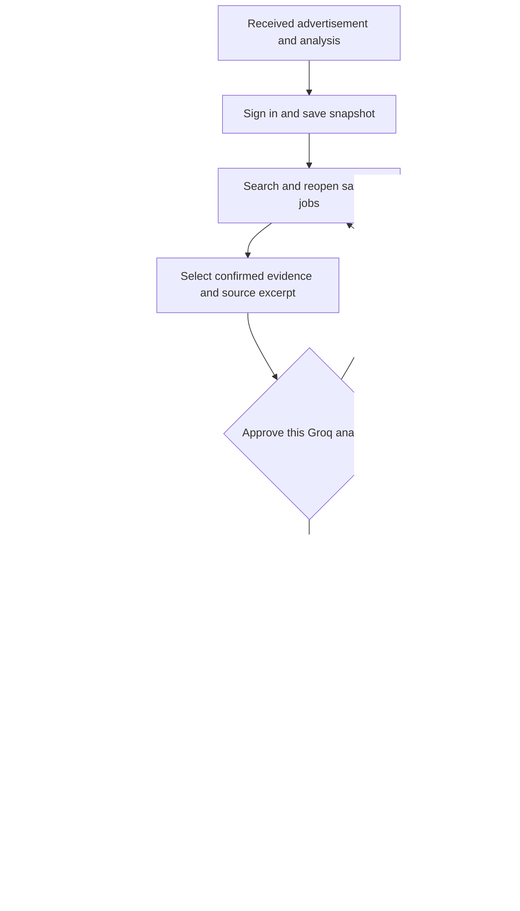

## Implemented local pilot entry and career history

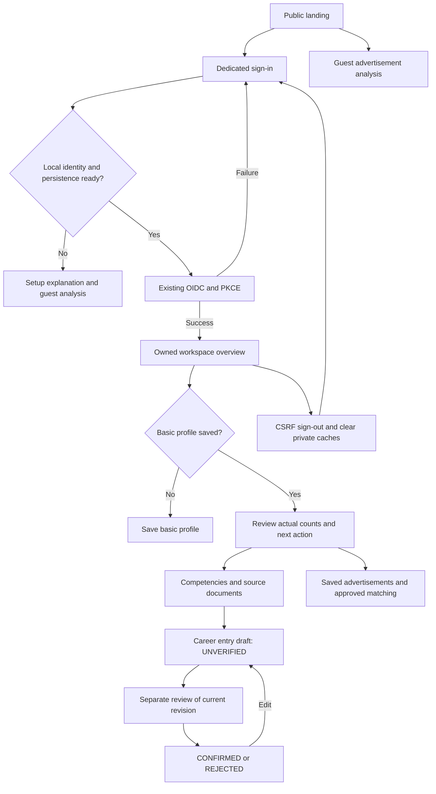

The root page now explains the product; public analysis is `/jobs/analyze`. Configured anonymous visits to private work areas lead to `/login` before private components mount. Missing setup provides actionable guidance instead. The backend still enforces every private request. The overview makes no model call and cannot infer missing competencies from failed reads. CV versions/export and case tracking remain subsequent work.

## Reviewed local pilot application flow

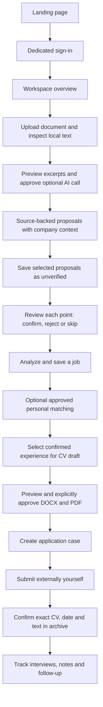

Provider failure keeps received advertisement/document text and any valid same-source result. Explicit headings and labelled practical fields can be organized locally, visibly labelled as such. All remaining text stays readable; missing facts are never invented.

## Actual document verification

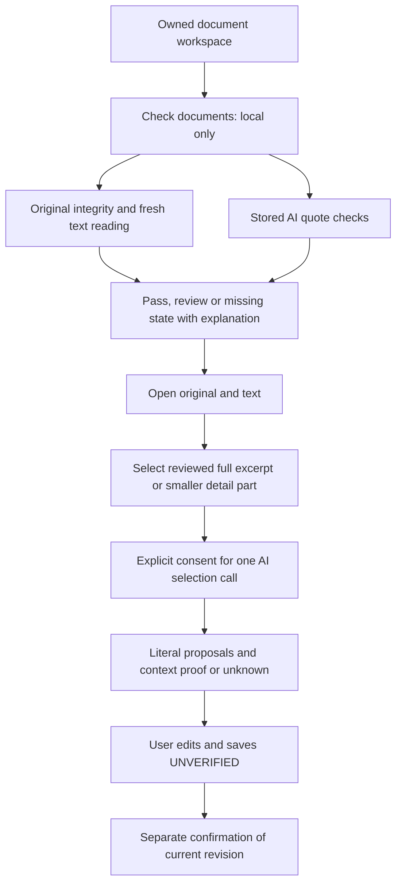

Technical checks do not certify semantics or completeness. Provider failures keep previous usable results; no automatic call or confirmation follows the check.

## Whole-document profile flow (ADR 0024)

Upload and read locally → inspect full previews → approve selected documents once → automatic sequential sourced analysis → bounded candidate summary → inspect/edit profile, history and skill cards → save unverified or explicitly confirm reviewed experience. Paused runs retain previous drafts and need manual approved continuation. Document deletion/rereading invalidates affected progress. See [FULL_DOCUMENT_REVIEW.md](docs/FULL_DOCUMENT_REVIEW.md).

## Provider-aware document and matching review

Load the non-secret AI configuration (Gemini document/profile defaults: 3.5 Flash-Lite; job/match: 3.5 Flash, unless explicitly overridden) → show recipients and models beside the editable preview → obtain explicit approval → send the matching fingerprint → retain progress and source-backed drafts. A changed recipient/model requires a refreshed configuration and new approval/run; previous suggestions remain reviewable. Whole-document analysis also includes career-history sources in final synthesis and retains already sourced profile sections.

## Approved provider recovery — 2026-10-08

AI quota/failure → retain result and source → Try with alternate configured provider → update compact provider/model identity → clear private consent → review approved source selection → approve new recipient → continue unfinished document portion or retry matching/public extraction. No request runs merely because a provider is selected. Public extraction reuses received text. A changed document preview requires a new run or explicit restoration of saved text. FINN retrieval separately offers configured Groq Browser Search and Gemini URL Context plans; changing the source provider requires its own approval and never happens automatically.

## Profile population and compact review queue (ADR 0027)

Inspect complete document previews → choose automatic profile population → approve displayed AI recipients → sequential analysis saves literal documented competencies and unverified history. The newest saved synthesis appears in the profile. Explicit technology lists are checked locally for omitted labels without extra AI calls.

Open competencies → default pending queue with a count → approve directly, edit a prefilled draft, set aside as draft or reject → item leaves pending and appears in the corresponding counted view. Expand source evidence as needed. Reopen or analyze again → current saved decisions remain; edited/rejected/deleted information is not restored automatically. Processed analysis wording may differ from later profile edits; use the linked profile record for current content.

Open saved job → Vurder personlig match → relevant confirmed evidence is preselected within limits → optionally adjust → approve displayed recipient → AI comparison and documented coverage percentage with calculation. Clarify an unresolved criterion inline with your own experience → explicitly confirm and save to profile → reassess through fresh recipient approval. No automatic AI call follows clarification. Advertisement prose has bounded keyboard-accessible scrolling.

## One profile card per competency

Open **Your competencies** → one card per normalized skill across projects/documents → inspect the combined existing explanations, with confirmed evidence and drafts in separate sections → expand contributions for exact sources, editing and individual review/history/delete. Identical explanation text appears once in the summary with every context retained. Rejected contributions remain inspectable but do not enter the active summary. Search matches the skill group and retains its related contributions; status filters count distinct skills. Grouping makes no AI call and changes no claim status. Editing/review affects only the selected saved claim.

Manual review identity includes the original contribution description. Two contributions sharing a skill/context/quotation keep independent decisions. Exact historical owned source-linked reviews can reconnect without the new ledger; ambiguous old deletion links block recreation without hiding unrelated proposals.

## Document source coverage and follow-up

Approved new run with optional missed-passage check → primary extraction → local source inventory → at most four bounded follow-up steps → synthesis → compact coverage panel and editable/profile-backed findings. Setting changes clear consent. Each step saves progress; repeated requests do not repeat committed calls. Follow-up uses the selected recipient/model and does not double-count source text. Inspect remaining literal excerpts in a scrollable document-attributed reader. Legacy runs do not gain follow-up steps. A represented passage is source usage, not semantic completeness or factual confirmation (ADR 0028).

New document analysis → inspect competency context from the surrounding literal employer/project section, including nested technical subsections → global/same-level boundaries leave unrelated lists without a company → review history with normalized explicit month endpoints and the original period wording. Existing saved runs/entries are not retroactively rewritten.

## Competency career relationships (ADR 0029)

Approved document profile processing → create a relationship only when one untouched career entry has exact shared documentary proof → keep the career entry's draft status → open Work and projects on the competency contribution to inspect employer/project, period, client and source. Ambiguous evidence leaves the relationship unset.

Choose Link to work or a project → search existing history → choose an entry explicitly → record USER relationship basis without confirming factual content. Remove a relationship → hide it from the active overview → preserve the decision across new document processing. Editing either factual record marks mismatched relationships for review; confirmation-only revisions preserve matching content. Conflicts retain the displayed information and require reloading. Viewing and changing relationships are local operations without AI calls.

## Long skills sections across automatic portions

Approve a complete document as usual → portions are handled automatically → local list recovery retains preceding section state across a portion boundary → complete literal list rows are recovered once, with the same source employer/project rules → supported findings follow existing profile population/review. A global or education/interests boundary ends the previous list/context. No extra consent, user-managed splitting or AI call is introduced. The developer expected-fact benchmark remains outside the user-facing coverage panel.

## Complete profile matching — 2026-10-09

Open a saved job, inspect the compact recipient/model preview and approve one analysis. All confirmed competency contributions are included automatically, including documented imports; there is no skill checkbox selection or 30-item match cutoff. Expand evidence/ad readers when needed. A saved weighted coverage percentage appears in the assessment and on the job card. New confirmed evidence marks automatic assessments stale. Failures retain the previous result and require explicit approval before changing recipient/model.

## Compare career history and documentary periods

Open Work and education → expand career history → inspect counted possible period differences or choose Compare career entries → view two saved records and documentary quotations side by side (stacked on mobile). Sources load only when opened. Choose another entry to compare employer/client/role wording explicitly. An old ongoing CV and a newer end date are possible differences, not automatic errors. Closing changes nothing. Correct this entry opens the existing prefilled editor; saving resets confirmation and refreshes the derived comparison. Source failure leaves the other record and quotations visible; reopen to retry. Deleted originals keep their existing labelled quotations.

## Planned joined preparation journey (not implemented)

Sign in → upload a CV and optional project accounts/certificates → inspect document reading and generated profile → correct sourced knowledge → analyze/save an advertisement → approve automatic matching → clarify inline → choose Apply for this job from the saved card or match result → inspect readiness and choose the base CV → approve the displayed AI recipient/text → review visibility and section-specific changes → approve, edit or reject text proposals. Preserve the original and stop before creating a new tailored CV version.

Provide an optional skippable tutorial and short contextual guidance throughout. Missing evidence links directly to relevant upload/review actions; explain useful document contents and actually supported formats. A score is documented coverage, not hiring probability. Unresolved criteria/formal barriers remain visible; no arbitrary score gate, forced manual skill selection or automatic external submission. See the product standard for contract and quality rules.

## Job-specific CV wording preparation (current implementation)

1. Open **Apply for this job** on an owned saved card or personal match. The dedicated page retains the advertisement and shows experience/match/base-CV readiness.
2. If evidence is missing, follow the profile/upload guidance. DOCX/text PDF usually reads better than scans; TXT/Markdown remain supported. Documents should describe roles, employers, dates, contributions and documented results. The optional three-step guide can be closed.
3. Review or refresh the full-confirmed-profile match and clarify unknown experience inline. Its percentage measures supported requirement coverage, not hiring probability. Old manually selected or stale assessments cannot support new suggestions.
4. Choose an owned base document (master by default), inspect the full CV/ad/confirmed evidence preview and selected AI provider/model, then approve this specific request. Nothing is sent automatically on opening the page.
5. The AI proposes up to 12 changes across literal source passages. Review original/proposed wording, reason and references; edit, approve or reject. Processed proposals leave the pending list and remain in **Processed** while the page is open. These decisions approve wording only, never add candidate facts.
6. Quota/provider failures retain previous proposals and source information. Choose an available alternate model explicitly and approve the new recipient. Per-choice waits do not carry to another model. Changed original text, knowledge revisions or match invalidate suggestions; their original references remain readable.
7. This milestone stops here: no application submission, new CV artifact/version or durable proposal storage. Reload/navigation clears proposal review; the original remains unchanged.

## Optional workspace guide and saved-data next actions

The signed-in dashboard offers a collapsed five-step guide: documents → profile review → advertisement/save → automatic personal matching → CV wording preparation. Users can skip, move backward/forward or hide it; no guide action starts AI, edits facts or records journey completion. Document guidance names currently supported DOCX, text-based PDF, TXT and Markdown, with useful employer/role/period/contribution evidence. Matching coverage is not hiring probability, and preparation does not submit an application or create a tailored file.

Next-action guidance uses owned metadata and existing competency/job lists. Uploaded documents without confirmed knowledge lead to source reading/approved analysis rather than repeated upload advice; saved opportunities with confirmed evidence lead to the saved-job workspace rather than another advertisement search. Missing/unavailable data is never interpreted as a completed or empty stage. Documents have a count/link and upload remains directly accessible. This does not inspect every saved match or imply current match readiness.

## Requirement and document review continuation — 2026-10-09

Advertisement extraction now requests distinct candidate criteria from the whole source instead of selecting twelve. Up to 128 source-backed requirements survive saving/reopening and matching. Invalid or absent AI assessments appear as “Not assessed”, with provisional percentage and no personal clarification form. Search and classification filters help review long matches. An excluded source preview is also unassessed, not a candidate gap.

A previously confirmed matching answer remains visible. Editing updates the same claim/revision and confirms it locally; retry after failed confirmation reuses the saved draft. Current approved matching input explicitly associates personal answers with the relevant criteria. No automatic new AI request or forced positive classification follows confirmation.

The document reader uses compact headings, counted icon tabs and supplementary help. Potentially missed source passages appear in a searchable bounded table. An empty pending queue links directly to documented/approved competencies. Source controls, exact quotations, original/OCR reading and approval remain available. Existing stored analyses are not silently upgraded; new analysis uses the new assessment distinction.

## Evidence relations and application priorities — 2026-10-09

A new match shows direct, transferable or undocumented relation to a criterion, with supplementary help. Explicit qualification criteria receive a separate AI-labelled tag; analogous practical work cannot give full credit or prove a formal qualification. Missing evidence remains uncertainty rather than a proven gap. Older saved results retain their original score and have no invented relation metadata; request a new approved analysis for these explanations.

Saved cards include the count of unresolved mandatory qualifications from the stored assessment. Application preparation groups documented examples to highlight, transferable experience to explain and qualification requirements to review. Expand a compact group to inspect every qualifying criterion, its advertisement quote and the referenced candidate contribution/context. No new AI call is made. Stale guidance is identified as the earlier assessment; incomplete readiness coverage is provisional. These existing-result groups do not themselves inspect the base CV; the approved visibility request below provides that separate judgment.

### Clarification confirmation and rejection review

Matching clarification now uses a compact answer card: visible status and context, writing aids for personal experience/related scope, a concise description field and an optional competency-label editor. These aids do not set the AI classification; only the explicit statement is confirmed. Saved drafts/rejected answers remain associated with their criterion, rather than being silently recreated.

An existing answer can be rejected through a separate confirmation dialog. Rejection uses the same revision-checked claim endpoint, excludes the answer from future matching and preserves history. It is not a statement that the candidate lacks the skill. Cancel/failure retains the answer. A deliberate edit and confirmation can restore the same entry. Success feedback explains the next match update, and no AI request is triggered by review.

## Source-bound CV visibility (ADR 0034)

From the owned preparation page, select the base CV and approve the displayed recipient/model. One request returns both criterion visibility and supported wording proposals. Filter/search the compact CV review; expand a criterion to inspect exact base-CV excerpts and the confirmed candidate contribution. Clear presentation, weak visibility, established but absent detail, uncertain evidence and unassessed output remain distinct. No profile confirmation, match-score change or additional provider request follows viewing this panel. Changed CV/match/selections mark the result historical; proposals retain existing review and staleness controls. Original files are retained and review remains page-session-only.

## Approved CV wording handoff

After approving individual text changes in preparation, open the full plain-text preview and choose Copy CV text. Only approved replacements are applied to the exact selected source snapshot; pending/rejected items preserve original wording and separators. A later edit returns its proposal to pending. Changed/unavailable required evidence disables copying as current; earlier text remains readable. Clipboard denial retains the selectable preview for manual copying. Nothing is sent, saved to the profile or written to the original file. Decisions/preview remain page-session-only (ADR 0035).

## Profile identity and private photo (ADR 0036)

Open **Min profil** → review the compact identity card, privacy, language and profile revision → optionally choose a JPG/PNG photo and inspect its local preview → explicitly save or remove it. The server validates the actual image, enforces upload/dimension limits and stores a normalized JPEG bound to the signed-in owner. The image is never sent to AI or cached. Photo changes do not modify the name/language profile revision. Existing profile settings remain limited to name and preferred language; additional personal preferences require a separately agreed data and visibility design.

Selecting an empty profile section loads that section's owned data and shows a clear loading/error state. With no saved records, documents lead to local reading and optional approved AI analysis; competencies can begin from a source or manual draft; career history can begin with one role/project/education entry. Each route stays within the profile, and no counts, confirmation or AI work are fabricated.

## Document-check result and source reader refresh

Open **Kontroller dokumentene** → review the timestamped technical result, grouped pass/review/not-run counts, per-source checks and exact limitation → rerun locally or open the named original in the document reader. The reader separates source reading, full-document AI review and manual evidence entry; it shows contextual guidance before manual fields, which are revealed after selecting a source quote. No extra AI call is made by the check view. A passing result does not establish semantic correctness or complete extraction.

## Reviewing potentially missed document passages

In a completed, explicitly approved document analysis, expand **Se passasjer som kan være oversett** to inspect bounded source excerpts, their category and original document. Search filters the displayed cards but never changes their source identity. Choose **Behandle som profilutkast**, select a competency/interest or career-history destination, edit the fields and retain the original excerpt as evidence. Save as an unverified draft, or separately check the confirmation box only when the information is personally accurate. The server checks the saved run revision, excerpt offset and exact quotation in both approved text and the retained original before creating the owned profile item. Repeating a successful action reuses its linked item; changed/deleted sources or a stale analysis are surfaced instead of silently creating a replacement. This does not rerun AI or change the original analysis coverage count.

The profile presentation remains separately labeled as AI-written draft wording. Its cited document excerpts show provenance, not that the generated wording is a confirmed personal fact. Editing that wording changes the saved text only; competency and career-history review retain their own source and confirmation states.
