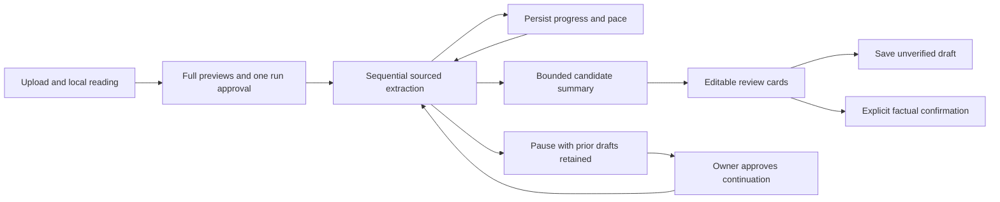

# Whole-document career review

Status: implemented and locally tested on `feat/full-document-career-review`; unpublished. The earlier manual-part interface is replaced in the production document workspace. Legacy analysis endpoints remain compatible.

## User flow

1. Open **My profile → Documents and AI profile**, upload sources and select a master CV when appropriate. Upload/extraction remain local.
2. Choose one document or **Summarize all documents with AI**. Review expandable full text, exclude documents or remove private details. Unreadable sources need local rereading/OCR or a readable replacement.
3. Approve the selected previews once for this run. Editing previews resets approval. Start the review; smaller portions are processed automatically, with real progress and visible pacing.
4. Review profile summaries, career-history drafts and competencies grouped by supported company/project and category. Search proposals. Edit the prefilled fields and inspect all retained quotations.
5. Save as an unverified draft, or explicitly confirm the reviewed information in the same action. Saving or importing alone does not establish truth. Career entries retain revision-linked source evidence.
6. Stop after a call or close the panel. Already stored work remains; an in-flight backend call may complete. Reopen and explicitly approve continuation. There is no automatic provider retry after failure.

## Data and limits

- PDF/DOCX/TXT/Markdown support and existing upload limits remain. Original bytes are unchanged. Normal PDF extraction now adjusts tracking before word segmentation and orders detected columns. It is heuristic; complex tables/layouts still need inspection. OCR is explicitly requested and local.
- A run includes 1–20 readable documents, up to 60,000 characters each and 1.2 million approved characters total. Internal serialized-byte limits can require fewer documents. These are capacity bounds, not completeness claims.
- Each portion generates up to 20 contribution groups with up to 12 explicit skill labels per group. Literal labels are split into separate reviewable proposals. Descriptions may be AI wording and require factual review. No neighboring technologies are inferred automatically.
- The accumulated snapshot keeps up to 300 competencies, 50 career drafts and 80 intermediate profile items; final summary has up to six supported kinds. Omitted evidence is disclosed. No source without readable text is counted as analyzed.
- Exact normalized skill/contribution/context duplicates combine source quotations. Different contributions, organizations/projects and unknown contexts are preserved. This is conservative equality, not fuzzy semantic deduplication.
- Year-only periods remain literal text; months, interests, qualifications and employer relationships are not invented. Prefilled history still requires review before becoming confirmed CV content.
- Summary drafts stay in the document analysis. Basic account name/language are not silently overwritten; draft prose is not a confirmed fact store.
- New runs replace the latest run in the same scope. Deleting a source or changing its extracted text invalidates affected progress. Saved claims/history are retained under existing disclosed quote-retention rules.

## Architecture and test boundaries

Owned REST endpoints resolve identity from the authenticated OIDC session. CSRF, strict input shapes, optimistic revisions, row locks, source rechecks and private no-store proxies protect reads/writes. V12 introduces run state and career-entry evidence; it does not implement the full proposed skill/concept/conflict graph. See ADR 0024, DOMAIN.md and GROQ_OPTIMIZATION.md.

Automated tests use synthetic documents and mocked AI responses for model-dependent behavior, with real PostgreSQL for ownership, migrations, source invalidation, evidence, review and replay. Six supplied private files were locally extracted and independently checked outside Git. Real Groq quality comparison was blocked by quota. Passing text coverage and keyword checks do not establish exhaustive competence extraction or semantic correctness.
