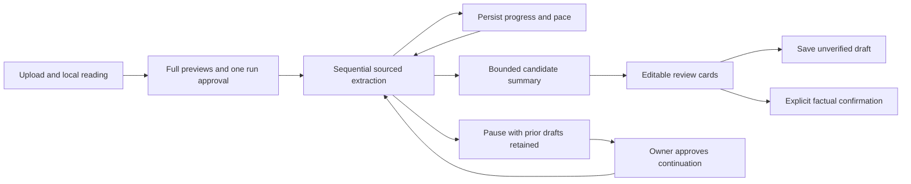

# Whole-document career review

Status: initial implementation merged in PR #16 on 2026-10-08. Related evidence/UI quality and approved provider recovery are developed separately on `feat/document-evidence-quality`. The earlier manual-part interface is replaced in the production document workspace. Legacy analysis endpoints remain compatible.

## User flow

1. Open **My profile → Documents and AI profile**, upload sources and select a master CV when appropriate. Upload/extraction remain local.
2. Choose one document or **Summarize all documents with AI**. Review expandable full text, exclude documents or remove private details. Unreadable sources need local rereading/OCR or a readable replacement.
3. Approve the selected previews once for this run. Editing previews resets approval. Start the review; smaller portions are processed automatically, with real progress and visible pacing.
4. Review profile summaries, career-history drafts and competencies grouped by supported company/project and category. Search proposals. Edit the prefilled fields and inspect all retained quotations.
5. Save as an unverified draft, or explicitly confirm the reviewed information in the same action. Saving or importing alone does not establish truth. Career entries retain revision-linked source evidence.
6. Stop after a call or close the panel. Already stored work remains; an in-flight backend call may complete. Reopen and explicitly approve continuation. There is no automatic provider retry after failure.

## Data and limits

- PDF/DOCX/TXT/Markdown support and existing upload limits remain. Original bytes are unchanged. Normal PDF extraction now adjusts tracking before word segmentation and orders detected columns. It is heuristic; complex tables/layouts still need inspection. OCR is explicitly requested and local.
- A run includes 1–20 readable documents, up to 60,000 characters each and 1.2 million approved characters total. Internal serialized-byte limits can require fewer documents. These are capacity bounds, not completeness claims.
- Each portion generates up to 20 contribution groups with up to 12 explicit skill labels per group. Literal labels are split into separate reviewable proposals. Descriptions may be AI wording and require factual review. No neighboring technologies are inferred automatically.
- The accumulated snapshot keeps up to 300 competencies, 50 career drafts and 80 intermediate profile items; final summary has up to six supported kinds. Omitted evidence is disclosed. No source without readable text is counted as analyzed.
- Exact normalized skill/contribution/context duplicates combine source quotations. Different contributions, organizations/projects and unknown contexts are preserved. This is conservative equality, not fuzzy semantic deduplication.
- Year-only periods remain literal text; months, interests, qualifications and employer relationships are not invented. Prefilled history still requires review before becoming confirmed CV content.
- Summary drafts stay in the document analysis. Basic account name/language are not silently overwritten; draft prose is not a confirmed fact store.
- New runs replace the latest run in the same scope. Deleting a source or changing its extracted text invalidates affected progress. Saved claims/history are retained under existing disclosed quote-retention rules.

## Architecture and test boundaries

Owned REST endpoints resolve identity from the authenticated OIDC session. CSRF, strict input shapes, optimistic revisions, row locks, source rechecks and private no-store proxies protect reads/writes. V12 introduces run state and career-entry evidence; it does not implement the full proposed skill/concept/conflict graph. See ADR 0024, DOMAIN.md and GROQ_OPTIMIZATION.md.

Automated tests use synthetic documents and mocked AI responses for model-dependent behavior, with real PostgreSQL for ownership, migrations, source invalidation, evidence, review and replay. Six supplied private files were locally extracted and independently checked outside Git. Real Groq quality comparison was blocked by quota. Passing text coverage and keyword checks do not establish exhaustive competence extraction or semantic correctness.

## Gemini and synthesis coverage

Recipient/model previews now bind new runs and persisted continuation (ADR 0025). Next Gemini steps use their own configurable pacing. Explicit responsibilities, mentoring and releases are requested alongside technologies with literal source labels and editable descriptions. Final synthesis also receives career-history quotations and retains sourced profile sections it omits. Whole-document coverage still does not prove all competencies were found; conservative exact deduplication and source/company proof remain.

## Evidence and recovery refinement

Mixed PDF layouts are processed as bounded vertical bands, distinguishing full-width prose/headings, genuine columns and date/employer rows. The original bytes are unchanged. Dated inline employment headers establish nearby source context; a global skills heading resets employer scope. These remain conservative heuristics, not semantic completeness guarantees.

The result has separate Competencies, Profile summary and Career history views. Identical skill labels/category within a company/project share one presentation card; distinct contributions and their source IDs/indices remain individually reviewable. Unknown contexts stay separated by document. Source processing counts are expandable and do not claim every competency was found. Profile navigation retains its section in the URL and respects browser back navigation.

A quota-paused run offers an explicitly approved provider change, preserving completed portions and evidence. Preview/model changes reset consent. Edited source previews cannot silently continue with the older approved text: restore the saved selection or start a new run. Both planned and actual successful provider/model identities are shown. See ADR 0026.

## Next priority: extraction completeness and profile population

Owner requirement: AI should structure uploaded evidence into the candidate's competencies and career history, not require retyping information already in a source. This is the next implementation increment, not a capability completed by provider recovery.

1. Inventory the complete approved source by section: employer/project/role/period, technology lists, responsibilities, achievements, education and explicit interests. Preserve source locators; a heading is not proof of an employer relationship on its own.
2. Extract individual competencies and distinct contributions, retaining the associated context and exact source evidence. A plain technology list supports a mention, not a claim about production depth, years or a particular delivered feature.
3. Compare supported results with the section inventory. Deterministically flag named technologies missing from explicit lists and uncaptured relevant passages. A bounded, resumable targeted repair step should process only missing evidence rather than repeat the entire document. Do not present text coverage as semantic completeness or silently spend unlimited calls.
4. Reconcile evidence across documents: one concept can have multiple distinct contributions/employers and source links. Equivalent aliases may be combined; different contexts, conflicting periods and punctuation-sensitive technologies remain distinct. Flag conflicts instead of selecting a convenient source silently.
5. Populate the owned profile/history from supported evidence with clear origin. The owner requested automatic documentary registration; its implementation must distinguish document-backed facts, user-confirmed facts and inferred proposals, handle edits/reanalysis/deletion/replay safely and never promote model prose into confirmation. Existing manual imports remain unchanged until that increment is tested.
6. Derive the candidate presentation from the current evidence revision. Refresh only when source-backed knowledge changes and respect the approved recipient. Unsupported interests, seniority and motivations stay absent.

Validation should use an independently reviewed expected-evidence checklist per supplied document, covering later sections, technology lists, employer/project association, date precision, education, multilingual labels, cross-document duplicates and conflicts. Measure captured expected facts and unsupported facts separately; a useful extraction has high recall without inventing experience. The local file-reading audit does not substitute for this semantic assessment.
